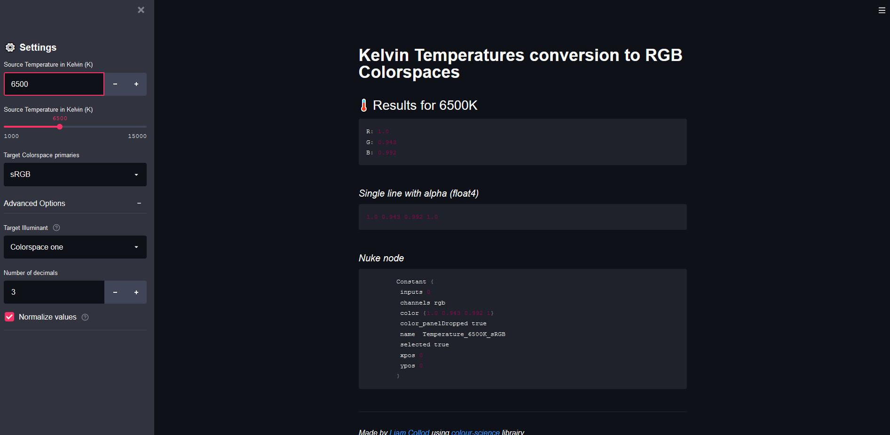

# Code source for Streamlit application

[App available online here](https://share.streamlit.io/mrlixm/streamlit_temperature2rgb/main/src/app.py)

The application allow to convert Kelvin temperatures to RGB with the given
 colorspace primaries.
 
