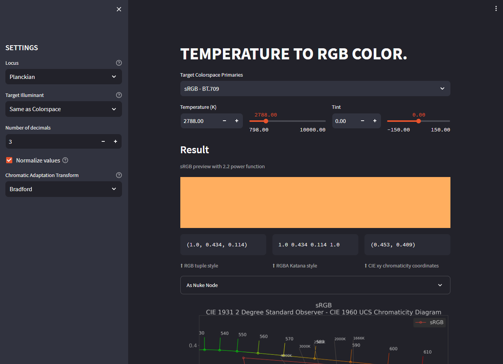

# streamlit_temperature2rgb

Convert Kelvin temperatures to RGB color with specified colorspace.
 

https://share.streamlit.io/mrlixm/streamlit_temperature2rgb/main/src/app.py

All features:

- Locus change (Daylight / Planckian)
- Target Illuminant.
- Tint slider for Planckian locus.
- Normalize values.
- Chromatic Adaptation Transform.
- Various RGB result representations.
- Graph plot in UCS Chromaticity Diagram

_Thanks to Thomas Mansencal for the help, and Christophe Brejon for
 investigating about the Daylight Locus._
