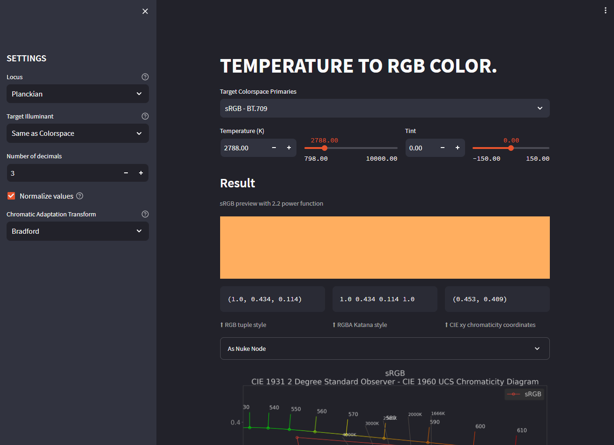

# streamlit_temperature2rgb

[](https://mrlixm-temperature2rgb.streamlit.app)

Convert Kelvin temperatures to RGB color with specified colorspace.
 


All features:

- Locus change (Daylight / Planckian)
- Target Illuminant.
- Tint slider for Planckian locus.
- Normalize values.
- Chromatic Adaptation Transform.
- Various RGB result representations.
- Graph plot in UCS Chromaticity Diagram

_Thanks to Thomas Mansencal for the help, and Christophe Brejon for
 investigating about the Daylight Locus._

## Usage

You can either access the app on the web at https://mrlixm-temperature2rgb.streamlit.app/
or run it locally on your machine.

For running it locally you will need:

- uv installed on your machine: https://docs.astral.sh/uv/getting-started/installation/
  - optionally you can also just download the uv executable somewhere and copy its path. 
    And instead of calling just `uv` in the next commands, you call the path to uv.

- this repository downloaded anywhere on your machine

Once this is done, open a terminal and run the following commands:

```bash
cd /path/to/downloaded/repo
uv run python -m streamlit run src/app.py --server.headless true
```

A message with an url should appear, ctrl+click on it your terminal supports it,
else copy the url in your web-browser.
