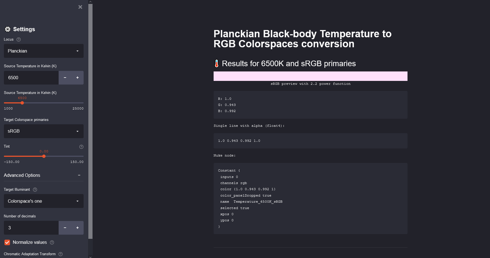

# Code source for Streamlit application

https://share.streamlit.io/mrlixm/streamlit_temperature2rgb/main/src/app.py

The application allow to convert Kelvin temperatures to RGB with the given
 colorspace primaries.
 

Additional  settings:

- Target Illuminant.
- Tint slider for Planckian locus.
- Normalize values.
- Chromatic Adaptation Transform.

_Thanks to Thomas Mansencal for the help, and Christophe Brejon for
 investigating about the Daylight Locus._
